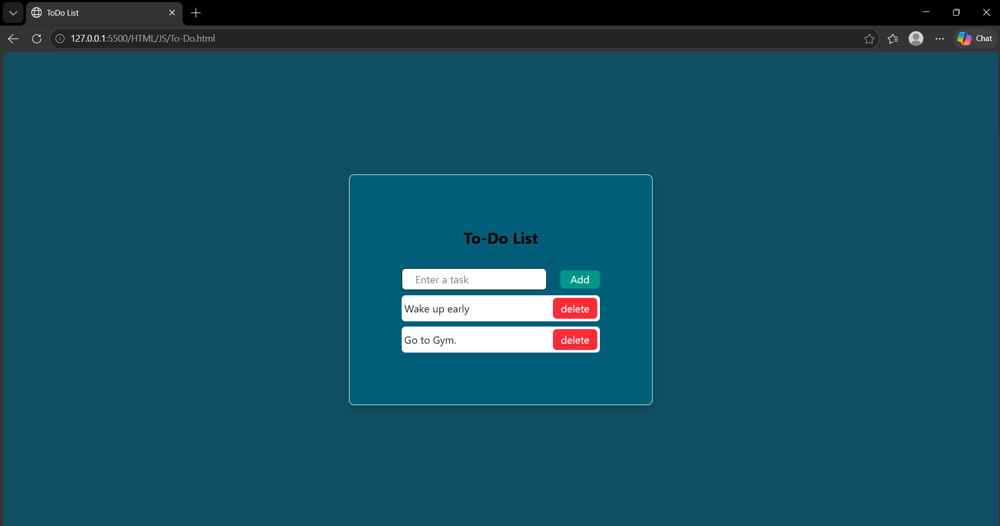

# To-Do List

A simple task management web application built using HTML, CSS, and JavaScript.

## Features

- Add new tasks
- Display tasks in a task list
- Delete tasks

## Technologies Used

- HTML5
- CSS3
- JavaScript

## How to Run

1. Clone this repository.
2. Open `index.html` in your web browser.
3. Enter a task and click the **Add** button.
4. Use the **Delete** button to remove a task.

## Project Preview

